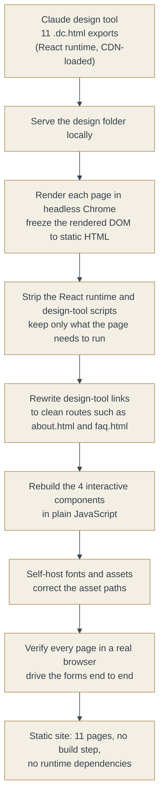

# Building the Coreso Collaborative Website with Claude Code and Claude's Design Tool

This repository documents how I built the Coreso Collaborative website end to end using Claude Code and Claude's design tool. It covers the brand and content decisions, the conversion of the design into an eleven-page static site, the four interactive components I rebuilt by hand, and the defects I found in the generated output and corrected.

**Live site:** [coresocollaborative.com](https://coresocollaborative.com)

**My role:** direction, architecture, content, and quality control. Claude Code produced the code and Claude's design tool produced the visual design, both under my direction. My work was defining what the site needed to be, specifying how it should be built, reviewing each step, and identifying where the output was incorrect.

The site sits alongside my knowledge-governance case studies. Those describe how I structure institutional knowledge so that AI can be trusted with it. This one covers a related capability: building with AI tools directly. The site also applies the same content-governance discipline I use in knowledge work, including consent handling, a privacy and terms structure, and per-page form handling.

> This is a curated case study, not the deployable source. Form endpoints, calendar links, and full page source are omitted.

## What This Work Demonstrates

- **Directing AI tools with judgment.** I set the requirements for Claude Code and Claude's design tool, reviewed their output, and identified the errors they introduced. Reviewing and correcting that output was a substantial part of the work.
- **End-to-end ownership.** Brand and content decisions, architecture, the build, debugging, and deployment were all handled by one person.
- **Content governance applied to a live site.** Consent handling, privacy and terms, per-page form handling, and a maintainable file structure follow the same content-governance approach I use in knowledge work.
- **Verification against the running site.** Each page was checked in a browser and each form was submitted end to end, and standing checks were added so that the same category of defect would be caught in future.

## Tools

- **Claude Code** for the build pipeline, the static conversion, and debugging
- **Claude's design tool** for the visual design and page layouts
- Headless Chrome to render and freeze the design output
- Plain HTML, CSS, and JavaScript in production, with no framework, no build step, and no runtime dependencies

## The Brief

Coreso Collaborative is my independent consulting practice, developed alongside my MBA. The site needed to present a defined service offering across eleven pages, self-host its fonts and assets, run without a build server, and remain maintainable by one person. There was no agency and no developer, and the live site was not to depend on any framework runtime.

The main constraint came from the starting material. The visual design was produced by Claude's design tool as `.dc.html` files that load a React runtime from a content delivery network at page load. That format is suitable for previewing a design, but not for hosting a production site, because it is slower, more fragile, and dependent on a third-party service remaining available. The design itself was suitable for production; only the delivery format needed to change.

The core task was therefore a conversion: take the React-runtime design export and produce plain, self-contained HTML that renders and behaves identically, without rebuilding eleven pages by hand.

## How I Worked with Claude Code

I worked with Claude Code as an execution partner. On each step I set the requirements, reviewed the approach it proposed before letting it run, and then checked the result against the running site rather than accepting the report that the work was complete.

1. **Requirements and constraints:** static output, no external dependencies at runtime, identical rendering, self-hosted fonts, and a single uploadable artifact.
2. **Approach:** Claude Code proposed and built the conversion pipeline. I reviewed it and redirected it where the approach was wrong.
3. **Verification:** generated code that appears complete is often not. Every page was checked in a browser, and several outputs reported as finished were broken in ways that were only visible on inspection.

My contribution was defining the problem and the constraints, reviewing each step, and identifying where the generated output was incorrect.

## The Build Pipeline

In practical terms, the design was rendered by a real browser, the finished HTML was captured, and everything the page did not need in order to stand on its own was removed. Any interactive element that did not survive that step was rebuilt by hand.

The result is eleven pages of plain HTML, five small scripts, self-hosted fonts, one favicon, and a single file to upload. There is no server code, no framework, and no dependency on a content delivery network.

## Defects I Found and Corrected

The generated output often presented as complete while containing errors that were only visible on inspection. The four below are representative. Each required diagnosis rather than regeneration.

### 1. A non-functional cookie banner baked into all eleven pages

Freezing the rendered page captured the cookie-consent banner as it appeared at that moment, as static markup with no behavior attached. Every page shipped with a banner that looked correct but did nothing: Accept and Decline had no effect, it ignored any saved choice, and it reappeared on every page. On the privacy page it had been captured twice. The working script was rendering a second, functional banner underneath it.

I identified the cause and directed the fix: remove every captured banner block from the static HTML so that the banner is only ever created by its script at runtime. A plain find-and-replace was not sufficient, because the blocks contain nested elements, so the removal had to match them structurally. I also added a standing check to confirm, after any future rebuild, that no captured banner remains in the static files.

### 2. Self-hosted fonts failing without a visible error

The font stylesheet referenced a path one level too deep. The fonts returned a not-found response and every visitor fell back to a default serif. Nothing failed visibly. I identified this by inspecting the network requests rather than relying on the page to report the problem, and corrected the paths.

### 3. The correct form key obscured by a fallback

Each form page contained two candidate submission keys: the real one set as a component property, and a fallback in the code. The fallback was the more obvious of the two and was incorrect. Submitting through it would have sent form entries nowhere. I traced which key the design actually used on each page and wired the correct one, which differed across the three forms.

### 4. A consent banner with insufficient contrast

The redesigned banner rendered as cream text on a cream background, which made it difficult to read. I revised it to a full-width dark bar with legible contrast, concise wording, and a close control that also records the choice so the banner does not reappear on the next page.

In each of these cases the generated output presented as finished. Identifying the problems required checking the result against the actual behavior of the site rather than the report that the work was done.

## The Four Interactive Components, Rebuilt by Hand

A frozen snapshot of a React application preserves how it looked, not how it worked. Four elements contained logic that did not survive the conversion, so I rebuilt them in plain JavaScript and tested each one end to end:

- A **contact form** with validated submission
- The **home page banner and popup**
- A short **two-minute reliability quiz**
- A longer **reliability-check intake** form

Each was submitted in full in an automated browser before launch, with the submission endpoint mocked so that testing did not send real entries.

---

*Coreso Collaborative is an independent consulting practice. This repository documents how the practice's website was built with AI tools. It is a curated case study, and sensitive configuration has been omitted.*
